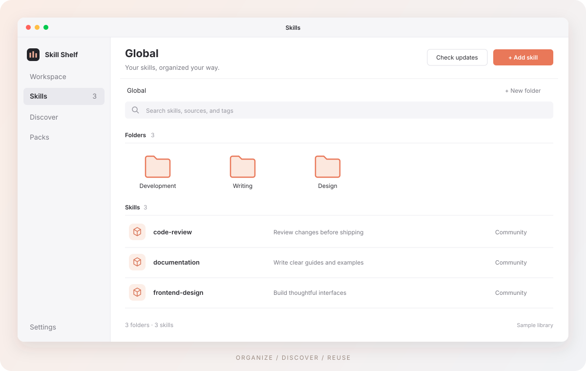

# Skill Shelf

**把你的 Agent Skills，放到同一个书架。**

一款 Mac 桌面应用，帮你整理、发现、更新 Skills，并在不同 AI 编程助手和项目之间复用。

[官网](https://voidrinz.github.io/skill-shelf/) · [下载 Mac 版](https://voidrinz.github.io/skill-shelf/#download) · [更新说明](https://github.com/voidrinz/skill-shelf-releases/releases) · [English](README.md)

Skills 越积越多，找起来也越来越麻烦。Skill Shelf 为它们提供一个清晰的收纳空间：查看已经安装的 Skills，把相关内容整理到一起，再把需要的 Skills 带到各个项目中。

界面示意图，使用示例数据。

## 为什么使用 Skill Shelf？

- **找到你已经拥有的 Skills。** 在同一个应用中查看全局和项目 Skills，通过搜索、标签和清晰的说明找到需要的内容。
- **像整理文件一样整理 Skills。** 支持文件夹、拖放、多选，以及图标、列表和分栏视图。
- **发现新的好工具。** 浏览 [skills.sh](https://skills.sh)，阅读 Skill 内容，在安装前查看安装命令。
- **让收藏保持更新。** 检查 Skill 更新，在任务队列中查看安装、更新和移除进度。
- **复用你自己的 Skills。** 将私有 Skills 收集成 Packs，通过复制或链接的方式添加到项目。
- **随时从菜单栏打开。** 快速查看概况、重新扫描，或者返回主界面的常用页面。

同时支持简体中文和英文、浅色和深色外观、Skill 文档预览、可选的 AI 翻译，以及缺失文件和失效链接检查。

## 下载和安装

**[下载 Skill Shelf Mac 版 →](https://voidrinz.github.io/skill-shelf/#download)**

M 系列芯片的 Mac 选择 **Apple Silicon**。点击官网上的下载按钮即可直接下载安装包。

1. 打开下载的 `.dmg` 文件。
2. 将 **Skill Shelf** 拖入 **Applications（应用程序）**。
3. 从应用程序中打开 Skill Shelf。

当前 Mac 安装包未经 Apple 公证，首次打开时 macOS 可能会提示警告。如果你决定继续打开，可以按照 [Apple 官方的应用打开说明](https://support.apple.com/zh-cn/102445)操作。

所有已发布的安装包和更新说明都放在 [skill-shelf-releases](https://github.com/voidrinz/skill-shelf-releases/releases)。从 v0.1.8 起，新版本仅支持 Apple Silicon。Intel Mac 可继续使用历史版本 v0.1.6 的安装包。

## 开始使用

1. **查看已有收藏。** 打开 Skills 查看全局收藏，或添加一个项目，查看该项目的 Skills。
2. **按你的习惯整理。** 将相关 Skills 放入文件夹，添加标签，选择适合自己的视图。
3. **发现并复用。** 在「发现」中寻找新 Skills，或创建 Pack，将常用 Skills 带到其他项目。

关闭主窗口后，Skill Shelf 会保留在菜单栏中；选择「退出」即可完全关闭应用。

## 常见问题

### 可以直接在浏览器里使用吗？

官网提供产品介绍和使用示例数据的交互预览。管理 Mac 上的 Skills 需要使用桌面应用。

### 整理 Skills 会改动原始文件吗？

文件夹、标签和布局保存在 Skill Shelf 本机数据中，整理收藏不会重写原始的 `SKILL.md` 文档。安装、更新、移除和部署 Skills 会改动对应的文件。

### 必须配置 AI 服务吗？

浏览和整理收藏不需要配置 AI 服务。可选的 AI 翻译会将选中的内容发送给你配置的服务商，保存的译文保留在你的 Mac 上。

### 如何更新应用？

在「设置 → 关于」中检查新版本，并前往下载页面。将新版 Mac 应用覆盖安装即可，已保存的书架数据会保留。应用更新和 Skill 更新分别管理。

## 反馈和参与

遇到问题，或有想法？欢迎[提交 Issue](https://github.com/voidrinz/skill-shelf/issues)。

如果你希望参与开发，请阅读[开发指南](docs/development.md)。构建、发布和官网部署说明保留在开发指南及其链接的文档中。
